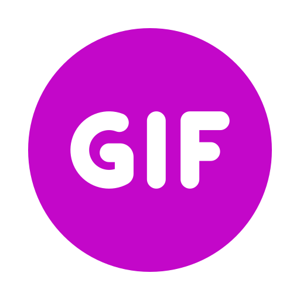

# gifAR
Fun project that gets gifs from the giant Giphy library and places them in the physical environment, with AR | Made with 8th Wall, A-FRAME and Giphy API

[![LinkedIn][linkedin-shield]][linkedin-url]

<!-- PROJECT LOGO -->
 

 

  

<h3 align="center">gifAR - bring gifs to life</h3>

  

Fun project that gets gifs from the giant Giphy library and places them in the physical environment, with AR | Made with 8th Wall, A-FRAME and Giphy API
  

  

<!-- ABOUT THE PROJECT -->
## About The Project

 

 
 
Simple proof of concept developed to see the results of connecting Giphy API to an AR experience.

 

 
  <h3>Challenges</h3

  The biggest challenge here was to use gifs with the A-Frame framework.
  Fortunately, there is a library called <a href="https://github.com/mayognaise/aframe-gif-shader" target="_blank">mayognaise</a>
  that makes everything as easy as adding a material to the gif entity.

<h3>Functionalities</h3>
 

  <ul>
    <li><b>Add GIFs button</b> - It shows a UI list with the top GIFs at the current time.</li>
    <li><b>GIF list and search</b> - The user can search and select a GIF, which will be added as the material of a box entity.</li>
    <li><b>Remove last GIF button</b> - It removes the last added GIF. The button can be pressed until there are no GIFs in the scene.</li>
  </ul>

(<a href="#top">back to top</a>)

<!-- LICENSE -->
## License

Nothing fancy, but just ask me and I can provide the code.

<!-- CONTACT -->
## Contact

Reach out - <a href = "mailto: victorcappa@imaginar.dev">Victor Cappa @imaginar</a>
 
<a href="https://www.linkedin.com/in/victor-cappa-50839788/">Linkedin</a>

(<a href="#top">back to top</a>)

[linkedin-shield]: https://img.shields.io/badge/-LinkedIn-black.svg?style=for-the-badge&logo=linkedin&colorB=555
[linkedin-url]: https://www.linkedin.com/in/victor-cappa-50839788/
